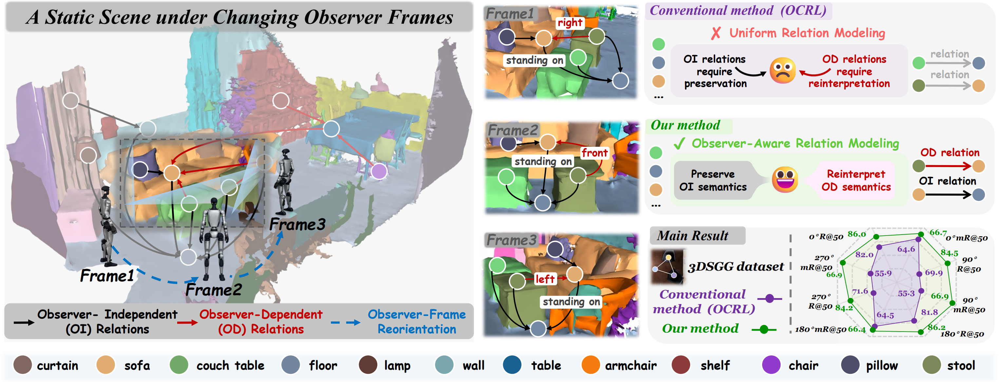
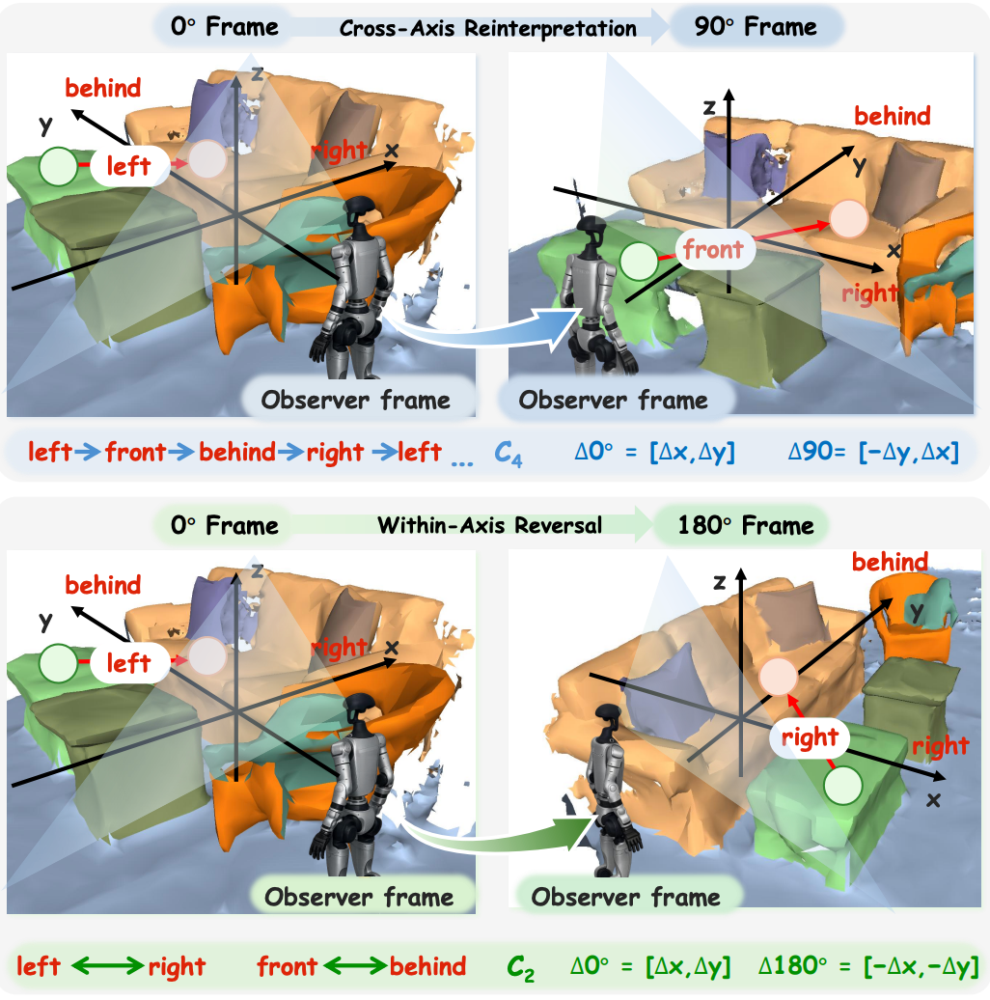
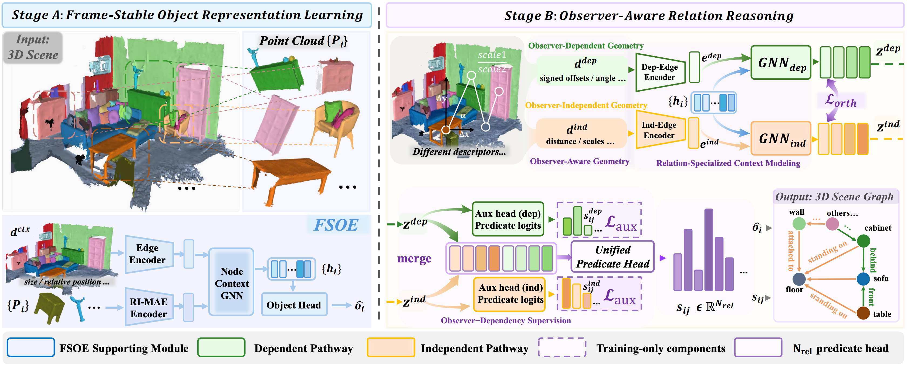
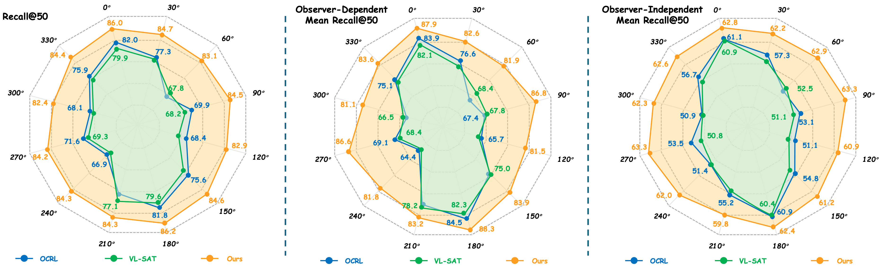
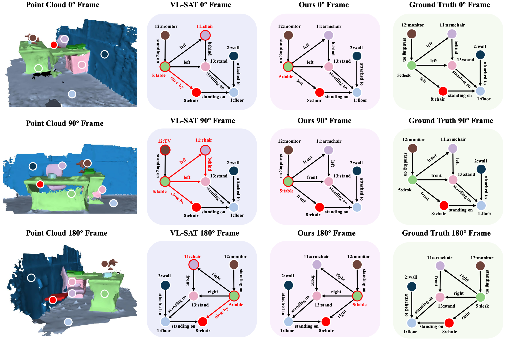

<div align="center">

# From Scene-Centric to Observer-Centric

## Modeling Observer-Aware Relations for 3D Scene Graph Generation

**Jingjun Sun<sup>1,\*</sup>, Chaowei Wang<sup>1,\*</sup>, Zhirui Liu<sup>2,\*</sup>, Jiaxu Tian<sup>1</sup>,  
Ming Yang<sup>1</sup>, Yaoxing Wang<sup>1</sup>, Shan Gao<sup>1,†</sup>**

<sup>1</sup> Northwestern Polytechnical University, Xi'an, Shaanxi, China  
<sup>2</sup> ShanghaiTech University, Shanghai, China  

<sup>\*</sup> Equal contribution.  
<sup>†</sup> Corresponding author.

[Paper](assets/pdf/paper.pdf) ·
[arXiv](http://arxiv.org/abs/2606.27412) ·
[Code](https://github.com/Gineven/TAD) ·
[Project Page](YOUR_PROJECT_PAGE_URL)

</div>

---

## 🚀 Overview

3D Scene Graph Generation (3DSGG) commonly assumes a fixed, scene-aligned reference frame. In observer-centric applications, however, the same physical scene may be represented under different local observer frames.

Our key observation is that relational predicates respond differently to observer-frame reorientation:

- **Observer-Independent (OI) relations**, such as *standing on* and *attached to*, should preserve their semantics.
- **Observer-Dependent (OD) relations**, such as *left*, *front*, *right*, and *behind*, should be reinterpreted relative to the current observer frame.

We introduce **Observer-Aware Relations (OAR)**, a 3DSGG framework that explicitly models these heterogeneous frame dependencies through frame-stable object representations, observer-aware geometric encoding, and specialized relation reasoning.

<p align="center">
  
</p>

---

## 🎥 Demo Videos

The following videos show the predicted scene graphs as the observer frame changes:

- [Demo 1 — Main rotating-scene result](assets/demos/hero.mp4)
- [Demo 2 — Scene 01](assets/demos/scene-01.mp4)
- [Demo 3 — Scene 02](assets/demos/scene-02.mp4)

> GitHub README pages do not support the same autoplay carousel used by the project website. Open the links above to view the original MP4 files.

---

## 💡 Motivation

A 180° reorientation mainly reverses directions within each horizontal axis:

- *left* ↔ *right*
- *front* ↔ *behind*

In contrast, 90° and 270° reorientations exchange the horizontal axes and require **cross-axis reinterpretation**. This makes them substantially more challenging for conventional relation models that encode all predicates in a single shared representation space.

<p align="center">
  
</p>

---

## ⚙️ Method

OAR contains four main components:

1. **Frame-Stable Object Encoder (FSOE)**  
   A pretrained RI-MAE encoder extracts rotation-stable object features, followed by contextual object reasoning.

2. **Observer-Aware Geometric Encoding (OAGE)**  
   The OD pathway preserves signed offsets and angular cues, while the OI pathway suppresses signed horizontal orientation and emphasizes stable geometric information.

3. **Relation Specialization**  
   Two non-shared relation GNNs model OI and OD cues separately. Auxiliary pathway supervision and an orthogonality regularizer encourage complementary representations.

4. **Unified Predicate Prediction**  
   The specialized pathway features are merged before the final classifier, retaining the original 26-class multi-label predicate space.

<p align="center">
  
</p>

---

## 📊 Main Results

OAR is trained **without frame-reorientation augmentation** and evaluated under controlled 0°, 90°, 180°, and 270° observer frames.

### Cardinal observer-frame reorientation

| Method | 0° Overall R@50 | 90° Overall R@50 | Δ90° | 90° OD mR@50 | 90° OI mR@50 |
|---|---:|---:|---:|---:|---:|
| VL-SAT | 79.9 | 68.2 | −11.7 | 67.8 | 51.1 |
| VL-SAT + RI-MAE | 81.9 | 71.0 | −10.9 | 70.3 | 54.7 |
| OCRL | 82.0 | 69.9 | −12.1 | 67.4 | 53.1 |
| OCRL (aug) | 76.8 | 76.0 | −0.8 | 78.0 | 57.7 |
| **OAR (Ours)** | **86.0** | **84.5** | **−1.5** | **86.8** | **63.3** |

OAR limits the 0° → 90° Overall R@50 drop to **1.5 points** and reaches **84.5 Overall R@50** at the challenging 90° cross-axis reorientation.

<p align="center">
  
</p>

### Standard 3DSSG benchmark

| Method | SGCls R@20/50/100 | SGCls mR@20/50/100 | PredCls R@20/50/100 | PredCls mR@20/50/100 |
|---|---|---|---|---|
| VL-SAT | 32.0 / 33.5 / 33.7 | 31.0 / 32.6 / 32.7 | 67.8 / 79.9 / 80.8 | 57.8 / 64.2 / 64.3 |
| OCRL | 36.1 / 37.7 / 37.8 | 29.8 / 32.0 / 32.1 | 70.2 / 82.0 / 82.6 | 57.1 / 64.6 / 64.8 |
| **OAR (Ours)** | **36.4 / 38.1 / 38.3** | **32.0 / 34.6 / 34.7** | **73.1 / 86.0 / 86.4** | **58.8 / 66.7 / 67.1** |

---

## 🔍 Qualitative Results

OAR better follows the expected re-indexing of Observer-Dependent predicates under observer-frame reorientation while preserving Observer-Independent relations.

<p align="center">
  
</p>

---

## 📁 Repository Structure

```text
.
├── index.html
├── README.md
└── assets/
    ├── demos/
    │   ├── hero.mp4
    │   ├── scene-01.mp4
    │   └── scene-02.mp4
    ├── figures/
    │   ├── overview.png
    │   ├── observer-reorientation.png
    │   ├── method-overview.png
    │   ├── results-table.png
    │   └── qualitative.png
    └── pdf/
        └── paper.pdf
```

---

## 🌐 Deploying the Project Page

This repository contains a static project website. To publish it with GitHub Pages:

1. Open the repository's **Settings**.
2. Select **Pages**.
3. Under **Build and deployment**, choose **Deploy from a branch**.
4. Select the branch containing `index.html`, usually `main`.
5. Select the root directory `/`.
6. Save the configuration.

The site will normally be available at:

```text
https://USERNAME.github.io/REPOSITORY-NAME/
```

### Changing the website name

The visible website name and the GitHub Pages URL are controlled separately:

- **Browser tab name:** edit the `<title>` element in `index.html`.
- **Large title on the page:** edit the main `<h1>` block in `index.html`.
- **GitHub Pages URL path:** rename the GitHub repository.
- **Custom domain:** configure it in **Settings → Pages → Custom domain**.
- **README project-page link:** replace `YOUR_PROJECT_PAGE_URL` near the top of this file.

---

## 📚 Citation

```bibtex
@misc{oar3dsgg2026,
  title  = {From Scene-Centric to Observer-Centric:
            Modeling Observer-Aware Relations for 3D Scene Graph Generation},
  author = {Jingjun Sun and Chaowei Wang and Zhirui Liu and Jiaxu Tian
            and Ming Yang and Yaoxing Wang and Shan Gao},
  year   = {2026}
}
```

---

## Acknowledgements

The project-page layout follows common academic project-page conventions and uses Bulma, Font Awesome, Academicons, and Google Fonts.
